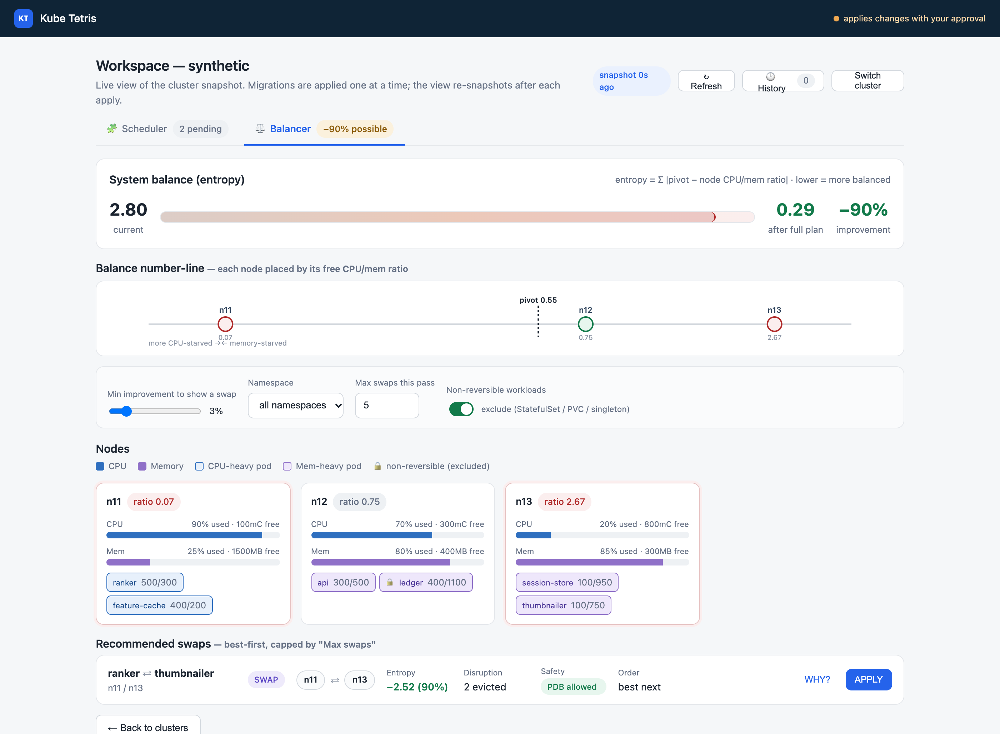
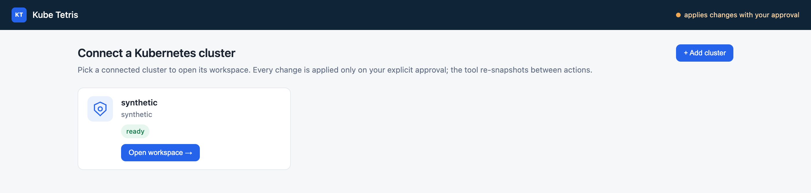
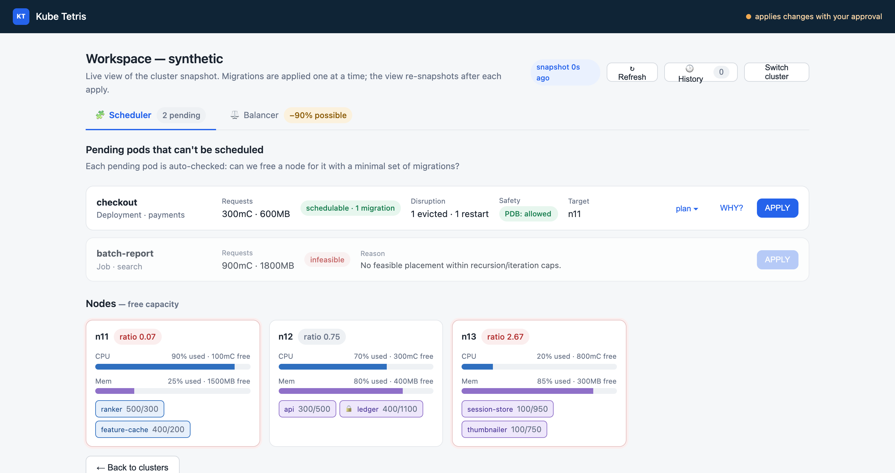
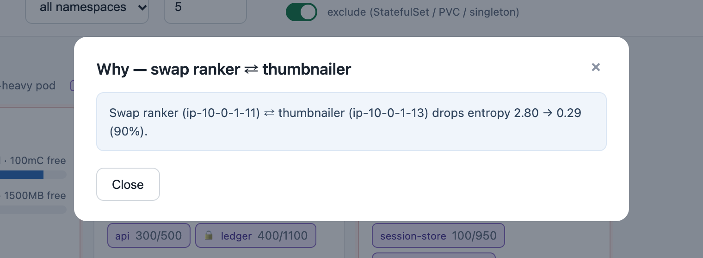
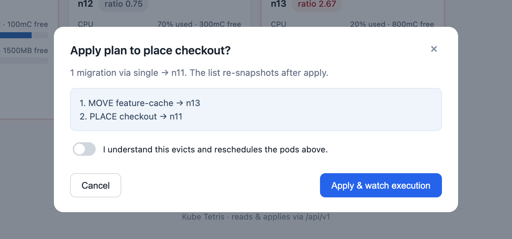
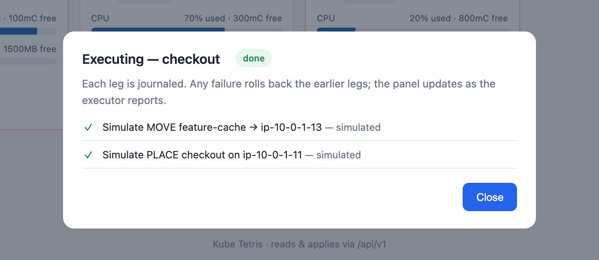
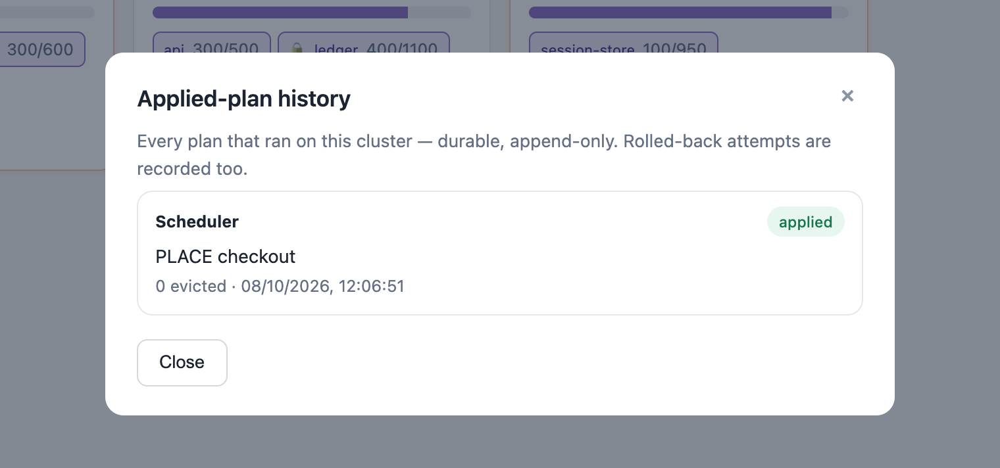

# Kube Tetris

**Human-in-the-loop pod-migration tool for resource-crunched Kubernetes clusters.**
An occasional, invasive-by-consent advisor — not an always-on custom scheduler.



Two recommendation engines over a live cluster snapshot:

- **Scheduler** — a `Pending` pod can't fit on any single node though the cluster has
  the capacity in total; compute the minimal set of pod **MOVE**s that frees a node,
  then **PLACE**.
- **Balancer** — nodes are CPU/mem imbalanced; compute **SWAP**s that reduce system
  entropy `Σ |pivot − node_cpu/mem_ratio|` toward 0.

Every action is surfaced with its computed effect; the operator applies one at a
time; the view re-snapshots between actions. Nothing is applied silently.

## What this is / isn't

- **Not** a custom scheduler. The default kube-scheduler keeps running; kube-tetris
  only produces plans the operator chooses to apply.
- **Not** always-on. It's an occasional tool for clusters that have grown fragmented
  or imbalanced — the kind of situation where the usual answer is "add a node".
- **Is** read-only until an operator ticks the ack checkbox and clicks APPLY.
- **Is** transactional: every apply is journaled and reversible per leg; a leg
  failure rolls back the earlier legs for the same move.

## Running

```bash
./gradlew :api:bootRun            # open http://localhost:8080
```

A synthetic cluster is seeded on startup so the UI is usable without a real
Kubernetes connection. The APIs under `/api/v1` are also usable directly:

```bash
curl -s http://localhost:8080/healthz
curl -s http://localhost:8080/api/v1/clusters/synth/snapshot
curl -s http://localhost:8080/api/v1/clusters/synth/pending
curl -s -X POST -H 'Content-Type: application/json' -d '{}' \
     http://localhost:8080/api/v1/clusters/synth/balance/plan
```

Container image:

```bash
docker build -t kube-tetris/api:local .
docker run -p 8080:8080 kube-tetris/api:local
```

In a cluster:

```bash
helm install kt deploy/helm/kube-tetris \
  --namespace kube-tetris --create-namespace
```

Advisor-only mode (strips every write RBAC rule; plans compute, APPLY returns
`Forbidden` at the apiserver):

```bash
helm install kt deploy/helm/kube-tetris \
  --namespace kube-tetris --create-namespace \
  --set rbac.readOnly=true
```

With durable storage (PVC-backed journal + registry):

```bash
helm install kt deploy/helm/kube-tetris \
  --namespace kube-tetris --create-namespace \
  --set persistence.enabled=true
```

## Walkthrough

**1. Connect.** Pick a registered cluster, or start with the seeded synthetic one.



**2. Scheduler.** Each `Pending` pod is auto-checked: is there a minimal set of
migrations that frees a node for it? Nodes below show live free capacity; the
🔒 badge marks pods that are non-reversible (excluded by default — the Balancer
toggle opts them in).



**3. Balancer.** The entropy meter shows current vs. projected after the full plan.
The number-line places each node by its free CPU/mem ratio around the pivot. The
swap list is best-first; non-first swaps stay disabled so plans apply in order.

The hero image at the top of this README is this screen.

**4. WHY?** Every recommendation surfaces its evidence — exactly what entropy drop
or capacity change is predicted, and which workloads are affected.



**5. Apply.** APPLY opens a modal with the plan steps and an ack checkbox; nothing
is sent to the executor until the box is ticked.



**6. Live execution.** Each leg is journaled: pre-flight → steer → evict → wait for
Ready → verify → cleanup. The panel polls `/api/v1/clusters/:id/apply/:journalId`
until the status becomes terminal. An Abort button is available until the run
terminates.



**7. History.** Every past apply is here — durable, append-only. Rolled-back and
needs-attention runs are recorded too, with the outcome pill.



## Architecture

```
engine/     pure JVM engine over a cluster snapshot (algorithms + unit tests)
collector/  Fabric8 Kubernetes reader → SnapshotView (+ owner refs, QoS,
            reversibility, PDB status, PVC, taints)
executor/   policy/v1 Eviction + cordon-based steer + Ready verify + rollback
            + AbortSignal + append-only Journal
api/        Spring Boot wrapper over /api/v1; async apply; per-cluster lock;
            synthetic apply simulator for the demo cluster
ui/         single-file HTML/CSS/JS SPA served by api at /
deploy/     Helm chart with scoped RBAC + opt-in PVC
```

Modules bind only to the DTO contract — never to each other's internals. Join keys:
pod `uid`, node `name`.

### Only the executor writes

`engine`, `collector`, `api`, and `ui` are read-only or compute-only. The executor is
the single module with cluster-write access; every write path is covered by
fault-injection tests that fail each named leg and assert the correct rollback
outcome:

- failure before the eviction leg → `ROLLED_BACK` with no net cluster change
- failure after the eviction leg → `NEEDS_ATTENTION` with an explicit journal entry
  so the operator can intervene

## RBAC

The Helm chart creates a `ClusterRole` that grants exactly:

| verbs | resources | always |
| --- | --- | --- |
| get, list, watch | `nodes`, `pods`, `persistentvolumeclaims`, `policy/poddisruptionbudgets` | yes |
| create | `pods/eviction` | unless `rbac.readOnly=true` |
| patch | `pods`, `nodes` | unless `rbac.readOnly=true` |

Nothing in the chart grants `delete` on pods or any write on workload controllers
(Deployments, StatefulSets, DaemonSets).

## Safety posture

- **Non-reversible workloads excluded by default** (StatefulSet, pods with
  `ReadWriteOnce` PVCs, `hostPath` volumes, DaemonSet, Job, mirror pods, pods with a
  `nodeName`/`nodeSelector` pin). Opt-in per plan with a warning.
- **PDB pre-flight** at the collector: `pdbOk` is derived from
  `policy/v1 PodDisruptionBudget` so the UI greys APPLY for plans the apiserver
  would refuse. The apiserver remains the authority at eviction time.
- **Kill switch**: `POST /api/v1/clusters/:id/apply/:journalId:abort` flips a
  cooperative abort signal checked between legs; the current leg finishes on its own
  terms, then the executor terminates with `ABORTED`.
- **Dry-run default** on first connect: APPLY requires the ack checkbox; the apply
  endpoint rejects requests without `"ack": true`.
- **Single in-flight apply per cluster**: a second concurrent apply returns `409`.
- **Durable journal**: with `persistence.enabled=true`, every apply is written to
  disk under `/data/journal`; the registry persists under `/data/registry`.

## Build

See [CONTRIBUTING.md](CONTRIBUTING.md) for the full style guide. The short version:

```bash
./gradlew test                  # engine + collector + executor + api
./gradlew :engine:test          # single subproject
./gradlew :api:bootRun          # bootable fat jar
```

## Lineage

Kube Tetris started as a 2018 Java prototype in this same repo. The current engine
is a port of that prototype's algorithms (`CapacityPlacementServiceImpl`,
`SystemControllerImpl`, `WorkLoadBalancerImpl`) into pure, I/O-free functions, with
several correctness fixes to the recursion, priority ordering, and eligibility
filters. The balancer no longer executes swaps inline; any cluster writes are
isolated to the executor module and gated on operator consent.

## License

MIT. See [LICENSE](LICENSE).
